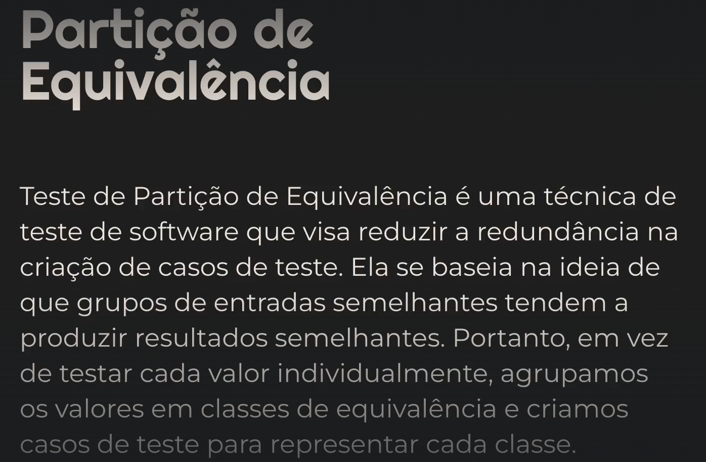
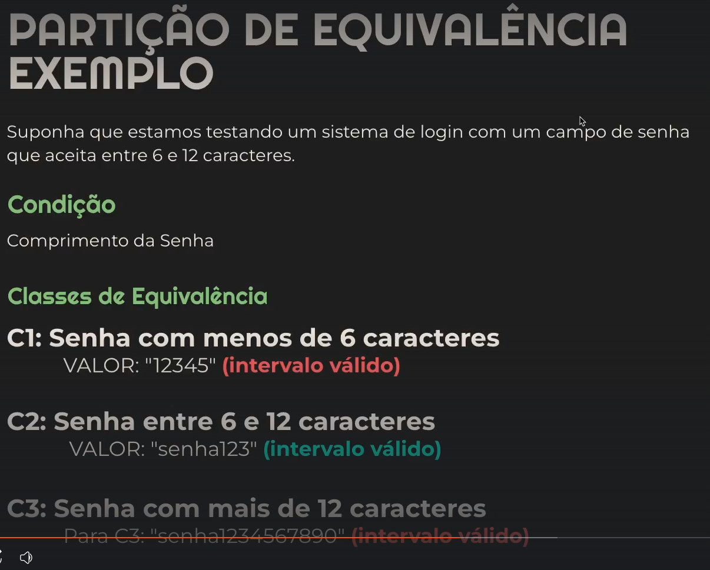
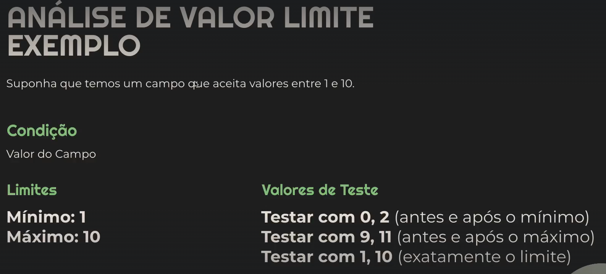
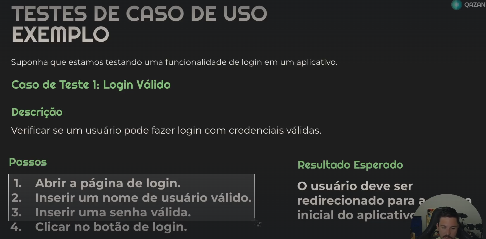
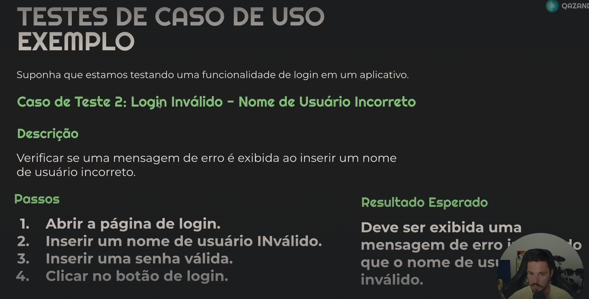

Teste de equivalencia.

Teste de analise de valor limite
Se concentra nos limites de valores de entrada, exemplo os limites do campo de senha.

Teste de caso de uso.

Testes exploratirios
Melhor ser feito manualmente, nao segue um roteiro de teste.

Testes Manuais X Testes automaticos.

