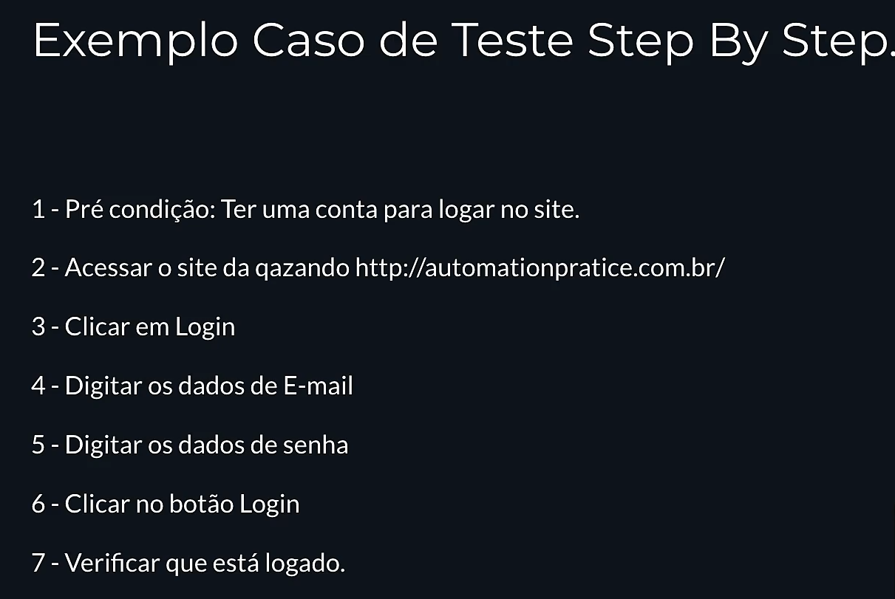
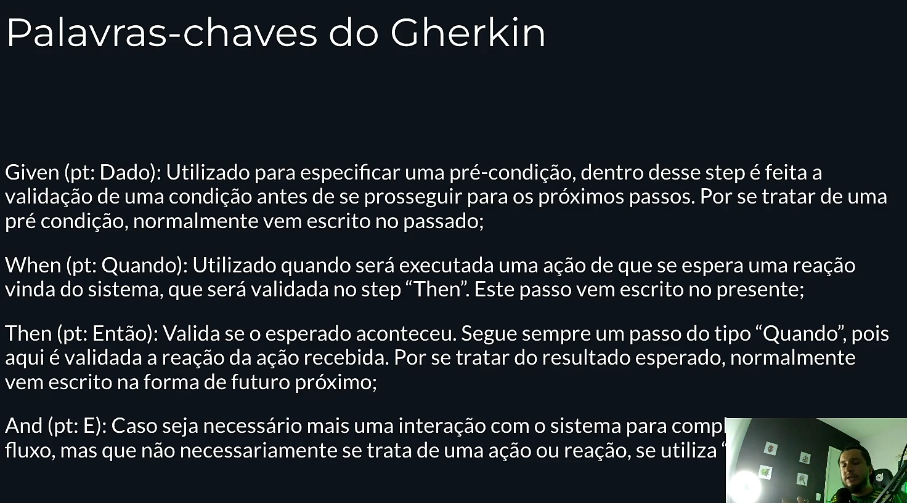

É uma linguagem utilizada para descrição de comportamento, serve para documentação de projeto e testes autoamtizados.
É escrito na forma de passos e deve ser focado na regra de negocio ou seja, mais no caminho feliz.

Exemplo de steps utlizado em projetos

Com Gherking é utlizado deste jeito.

BDD é quando todo o time utiliza a linguagem para escrever conversas estruturadas do comportamento de um sistema.(BDD quando um time utiliza a linguagem)
Gherkin é a linguagem utilizada no BDD, documentação e etc...
Cucumber é um plugin que transforma o gherkin em metodo de automação.
